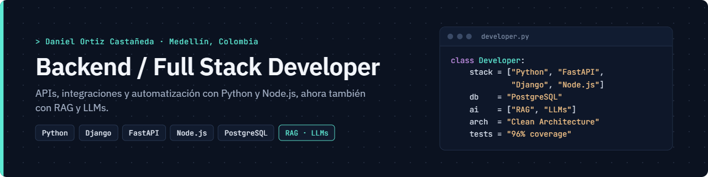

## Hola, soy Daniel

Desarrollador **Backend / Full Stack** en Medellín, Colombia. Llevo más de 3 años construyendo servicios en producción con **Python, Django y PostgreSQL** para el sector de certificación digital, e implementando flujos en plataformas **Node.js/Express** con automatización RPA. Hoy también construyo aplicaciones de **IA aplicada con RAG y LLMs**.

### En qué trabajo

- APIs REST y SOAP, e integraciones con ERP y plataformas de terceros
- Optimización de consultas en PostgreSQL y automatización de procesos
- Aplicaciones RAG con FastAPI, ChromaDB y LLMs intercambiables
- Clean Architecture, testing y calidad de código

### Proyectos destacados

| Proyecto | Stack | Lo más relevante |
|---|---|---|
| [Asistente RAG de Validación de Cobertura Médica](https://github.com/danielorc27/asistente-rag-cobertura-medica) | Python · FastAPI · ChromaDB · GPT-4.1 / Gemini | Clean Architecture · 113 tests · 96% de cobertura |
| [Sistema POS e Inventario con Facturación DIAN](https://github.com/danielorc27/[REPO-POS]) | Django · PostgreSQL · API Factus | Multi-tenant · RBAC · patrón Adapter/Provider |

### Stack

- **Backend:** Python · Django · Django REST Framework · FastAPI · Node.js · Express
- **IA:** RAG · LLMs (GPT-4.1, Gemini) · Embeddings · ChromaDB · Prompt Engineering
- **Datos:** PostgreSQL · MySQL · Sequelize
- **Calidad:** Pytest · MyPy · Ruff · Clean Architecture · SOLID
- **Infra:** Linux · Nginx · Gunicorn · PM2 · Git

### Contacto

[LinkedIn](https://www.linkedin.com/in/daniel-ortiz-casta%C3%B1eda-a7a9b92ba) · d.ortizcastaneda27@gmail.com
